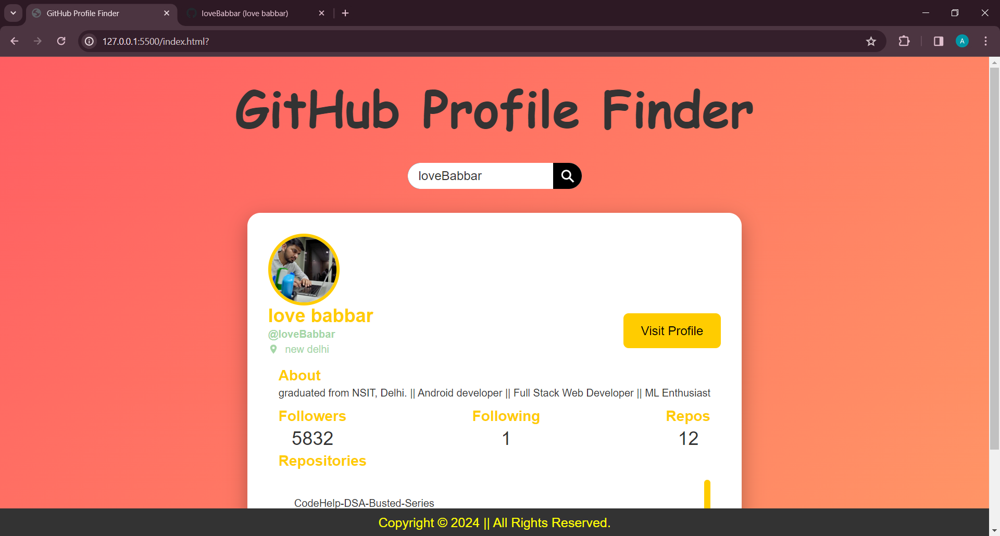
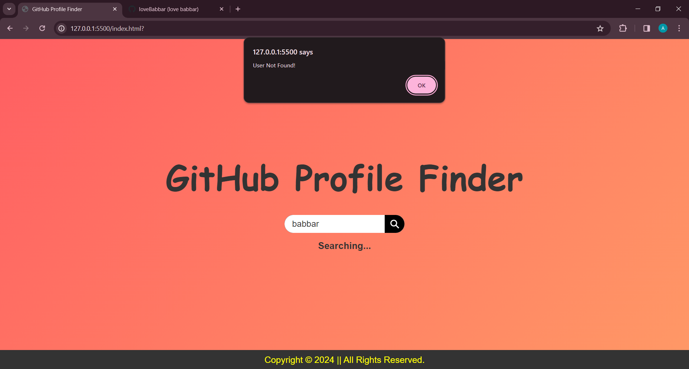

  
# GitHub Profile Finder :monocle_face:
  

In This Project, We Can Search GitHub Users By Their Username. The Search Query Returns The User's Profile Information Along With The List Of Repositories Present In The Profile.

## Features :eyes:

### Home Page

### Search Result

### User Not Found

## Tech Stack :desktop_computer:

- HTML
- CSS
- JavaScript
- BootStrap

## Developer :man_technologist:

<table>
<td>

Arpit Aggarwal

</td>
</tr>
</table>